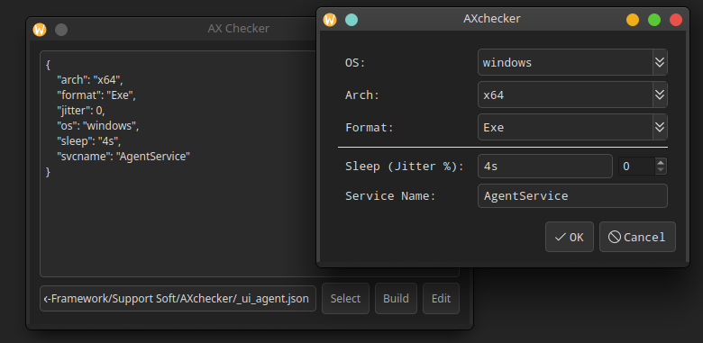
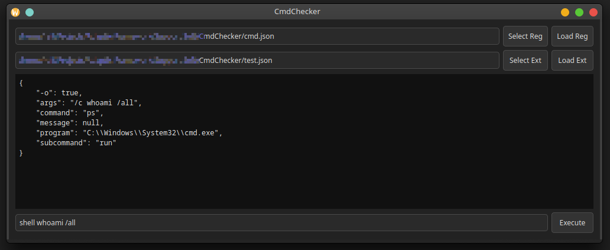

# AX-Support-Soft
Support Software for Adaptix

---

## AxChecker

AxChecker is a helper application for checking json files used in WidgetBuilder to create forms in listener and agent plugins in Adaptix. AxChecker parses a JSON file, creates a dialog box based on it, and outputs data that will be sent to the Adaptix server. Example for [_ui_agent.json](./files/example/_ui_agent.json):

---

## CmdChecker

CmdChecker is a helper application for checking AX scripts used in the Adaptix agent plugin and client extensions. CmdChecker parses the JSON file, processes the entered commands and outputs data that will be sent to the Adaptix server. Example for [cmd.json](./files/example/cmd.json) and [test.json](./files/example/test.json):

---